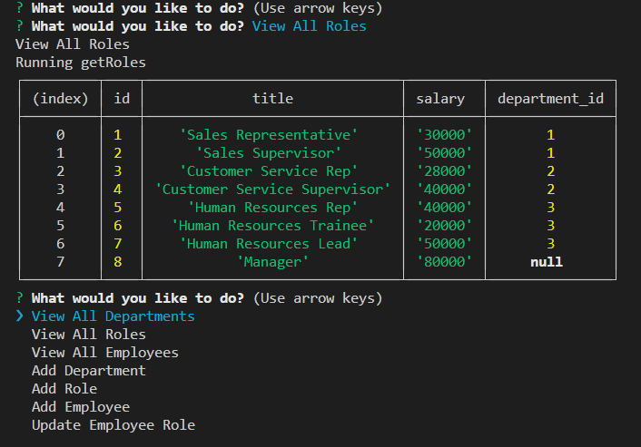

# Employee-Tracker

The Purpose of this assignment was to view and edit a database from sql directly from the terminal. Once the user installs the npms and runs node index.js, they are prompted with a list asking what they would like to do. The user can select to view the tables, which automatically generate in the terminal, allowing them to view the complete table. The function automatically runs again once an option is selected, allowing them to open more tables. When the user selects the "add" options, they are then prompted with more details needed in order to update the tables.

# Installation

Use `npm install`
Run on `index.js`
